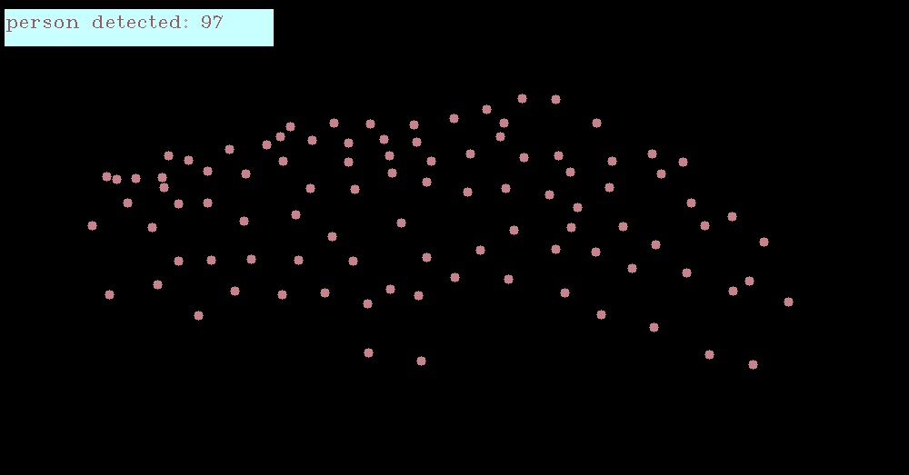

## Density Map for Crowd Counting

This repository contains crowd counting and density map. This notebook is detecting and counting people with [P2PNet](https://github.com/TencentYoutuResearch/CrowdCounting-P2PNet) in drone captured images. In addition, it is creating a density map. 

